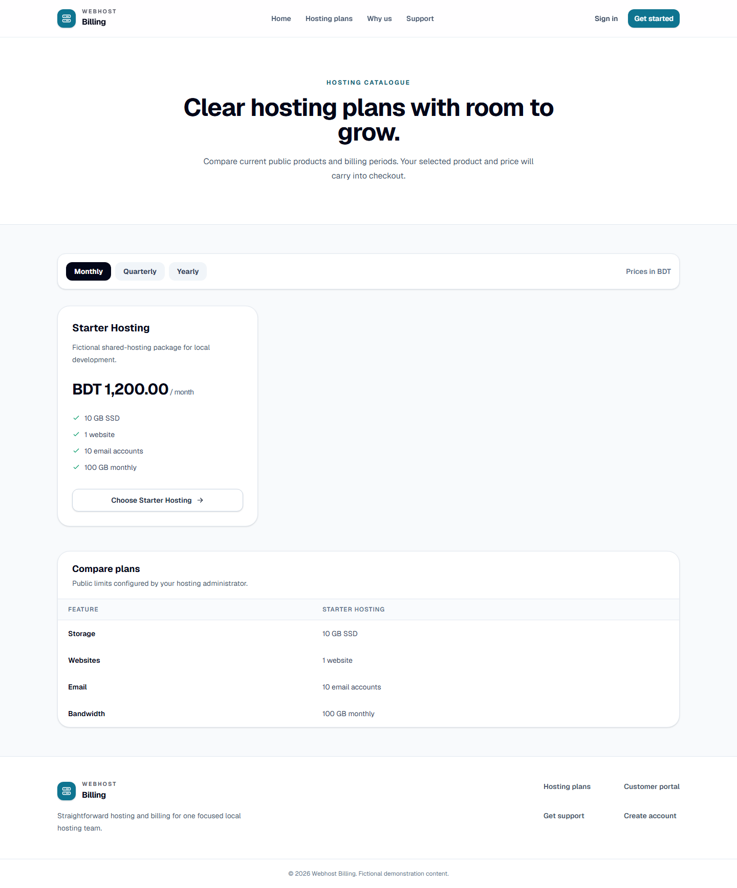
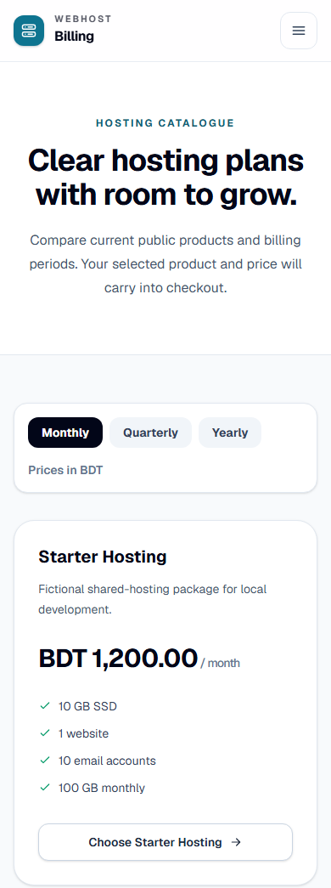
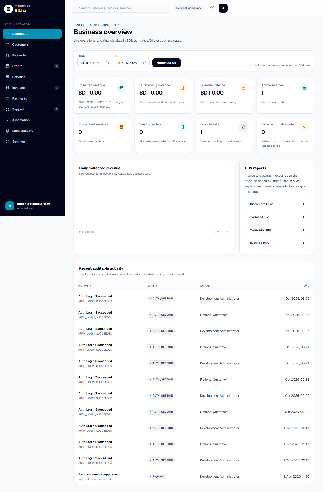
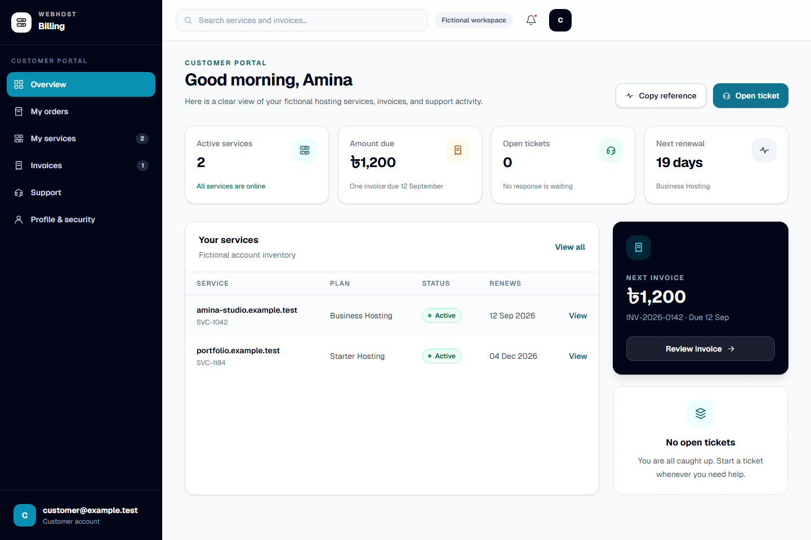

# Safe Evaluation Demo

The safe evaluation demo is the shortest supported way to inspect Webhost Billing.
It runs a production-built web/API pair with a separate local PostgreSQL database,
Redis, and same-origin gateway. Every record is fictional.

বাংলা দ্রুত শুরুর সহায়িকা: [`SAFE_EVALUATION_DEMO_BN.md`](SAFE_EVALUATION_DEMO_BN.md)।
This English guide remains canonical.

> [!WARNING]
> This remains an alpha technical preview and is not fit for live use. Do not enter
> real customer data, credentials, payment evidence, email addresses, domains, or
> provider secrets. The demo is not a staging or production deployment.

## Start with one command

Requirements: Node.js 24 with Corepack, Docker Engine or Docker Desktop, and Docker
Compose v2. Port `3100` on loopback must be available.

Check those local prerequisites first:

```bash
corepack pnpm demo:doctor
```

The doctor command is read-only. It reports sanitized Docker/Compose versions,
Docker Engine availability, whether `127.0.0.1:3100` can be bound, and whether the
local runtime file exists. It does not create or read `.demo-runtime/demo.env`, does
not print command errors or credentials, and does not start, stop, rebuild, or remove
anything. A missing runtime file is normal before the first start; `demo:up` creates
it locally.

When every prerequisite passes, start the demo:

```bash
corepack pnpm demo:up
```

The first run builds the application images and can take several minutes. When the
health checks pass, the command prints:

- the local URL, `http://localhost:3100`;
- a generated password for `admin@example.test`; and
- a different generated password for `customer@example.test`.

The passwords and other random demo secrets live only in the Git-ignored
`.demo-runtime/demo.env` file. Show the same logins again with:

```bash
corepack pnpm demo:credentials
```

Do not publish that file, paste its values into an issue, or reuse its passwords.
Only `demo:up` creates the file in the ordinary demo lifecycle. `demo:credentials`,
`demo:status`, `demo:logs`, and `demo:down` require an existing readable regular
file and refuse before Docker if it is missing or unsafe.

## Five-minute walkthrough

1. Open `http://localhost:3100/hosting` and select **Monthly**. Inspect the public
   catalogue and its fictional Starter Hosting plan.
2. Sign in as `customer@example.test`. Open **Services**, **Invoices**, **Orders**,
   and **Support** to inspect the ownership-bound customer workflows and seeded
   records.
3. Sign out, then sign in as `admin@example.test`. Inspect the dashboard and the
   **Customers**, **Orders**, **Invoices**, **Payments**, **Services**, and
   **Support** areas.
4. Treat every action as disposable evaluation only. External email, payment, and
   hosting providers are not running in this stack.
5. Stop the demo when finished:

   ```bash
   corepack pnpm demo:down
   ```

`demo:down` stops containers but retains the isolated fictional volumes and generated
credentials, so the next `demo:up` is repeatable. It never targets the repository's
ordinary development or production Compose projects.

## Permanently reset the fictional demo

> [!CAUTION]
> Reset permanently removes the safe demo's fictional PostgreSQL and Redis volumes,
> its dedicated containers and networks, and its generated local credentials. Use
> `demo:down` when you only want to stop the demo and retain its state.

The reset command accepts one exact confirmation flag and no target overrides:

```bash
corepack pnpm demo:reset -- --confirm-reset-demo
```

Without that exact flag, the command refuses before inspecting paths or invoking
Docker. The confirmed reset validates the fixed repository paths, refuses symbolic
links and non-regular runtime paths, and targets only the fixed
`webhost-billing-demo` Compose project defined by `demo/compose.demo.yaml`. Docker
calls are pinned to the built-in local `default` context; selected or environment
context overrides cannot redirect reset. Docker output and filesystem errors are
never echoed.

The command removes and verifies the dedicated demo Docker state before deleting the
exact Git-ignored `.demo-runtime/demo.env` file. If Docker cleanup fails or any
project-labelled container, network, or volume remains, the generated runtime file
is preserved. Repeating reset after a successful reset is safe and reports that the
credentials were already absent. Cached images are not pruned, and development,
staging, production, provider, and unrelated Docker resources are never targeted.

Create a new fictional database and new generated credentials after reset with:

```bash
corepack pnpm demo:up
```

## Safety boundary

The demo has several independent safeguards:

- the gateway publishes only `127.0.0.1:3100`;
- application and data services use an internal Compose network; only the hardened
  gateway joins a separate ingress bridge so Docker can publish the loopback port;
- the gateway's outbound firewall permits only its internal web/API upstreams,
  Docker DNS, loopback traffic, and replies to evaluator requests;
- bKash and SSLCOMMERZ are explicitly disabled, and no cPanel, SMTP, worker, or
  scheduler process runs;
- PostgreSQL and Redis have dedicated named volumes and no host-published ports;
- the initializer refuses to bootstrap users unless `DEMO_MODE=fictional-only` and
  the database host/name exactly match the demo database;
- passwords and service secrets are randomly generated, remain outside Git, and are
  not baked into images; and
- the gateway sends `X-Robots-Tag: noindex, nofollow, noarchive`.

The local gateway uses HTTP because it is loopback-only evaluation. The documented
production topology still requires HTTPS, protected secrets, external controls, and
all acceptance gates. Running this demo does not change production `NO-GO`.

## Demo commands

| Command                                            | Purpose                                             |
| -------------------------------------------------- | --------------------------------------------------- |
| `corepack pnpm demo:doctor`                        | Check prerequisites without changing local state    |
| `corepack pnpm demo:up`                            | Build, initialize, start, and health-check the demo |
| `corepack pnpm demo:credentials`                   | Reprint the generated fictional logins              |
| `corepack pnpm demo:status`                        | Show container state and health                     |
| `corepack pnpm demo:smoke`                         | Verify principal read-only evaluator paths          |
| `corepack pnpm demo:logs`                          | Show the latest 100 redacted log lines and exit     |
| `corepack pnpm demo:screenshots`                   | Recreate the reviewed evaluator screenshots         |
| `corepack pnpm demo:a11y`                          | Run the bounded accessibility smoke audit           |
| `corepack pnpm demo:down`                          | Stop the demo and retain its fictional state        |
| `corepack pnpm demo:reset -- --confirm-reset-demo` | Permanently remove only dedicated demo state        |

## Functional smoke verification

With the healthy safe demo already running and the repository-pinned Playwright
Chromium installed, execute:

```bash
corepack pnpm demo:smoke
```

The command first requires the fixed regular `.demo-runtime/demo.env` file and an
HTTP-successful `http://localhost:3100/ready` response. It then verifies the public
hosting catalogue, customer login and ownership-bound overview, and administrator
login and dashboard. The assertions wait for named headings, fictional seeded
content, and primary actions rather than arbitrary delays.

`demo:smoke` is read-only with respect to application business records, Docker, and
providers. It does not start, stop, build, reset, or inspect Docker; submit checkout,
billing, payment, provisioning, support, or administration mutations; or accept an
origin override. Browser requests outside the fixed loopback origin are blocked.
Signing in creates only ephemeral authenticated sessions.

Output is allowlisted to `/ready`, `/hosting`, `/portal`, and `/admin` pass/fail
lines plus fixed remediation. Generated passwords are read only inside the child
browser process. Runtime values, cookies, tokens, raw process/browser errors, DOM or
response bodies, screenshots, traces, and videos are neither printed nor retained.
The command exits non-zero if a precondition or route fails. It is a functional
evaluation smoke check, not complete end-to-end or production acceptance.

## Accessibility smoke audit

With the healthy safe demo running, execute:

```bash
corepack pnpm demo:a11y
```

The command uses the repository-pinned Chromium and `@axe-core/playwright` to audit
the public hosting catalogue, customer sign-in, authenticated customer overview,
and authenticated administrator dashboard at the fixed
`http://localhost:3100` origin. It fails on automated serious or critical WCAG A/AA
findings. Output is deliberately limited to routes and bounded rule IDs; generated
passwords, cookies, tokens, node details, raw browser errors, screenshots, traces,
and videos are never printed or retained.

The audit also checks that the skip link is first in the keyboard path and that the
mobile public navigation can be opened, entered, and closed from the keyboard. It
waits for named headings, form controls, and authenticated page content rather than
arbitrary delays. It signs in only with the generated fictional accounts and does
not submit a billing, payment, provisioning, support, provider, or other business
mutation.

This is a bounded automated smoke test, not accessibility certification. It cannot
replace assistive-technology testing, human keyboard review, usability evaluation,
or the component checks described in `FRONTEND_DESIGN_SYSTEM.md`.

## Screenshots









The screenshots are generated from the safe demo with the repository-pinned
Playwright Chromium. They are examples, not proof of production readiness. The
mobile catalogue uses a 390-pixel-wide touch viewport and ends immediately below the
primary **Choose Starter Hosting** action. Capture waits for the catalogue heading,
fictional Starter Hosting plan, selected monthly period, and checkout action; it does
not use an arbitrary delay. Animations and carets are disabled only while pixels are
captured so repeat runs do not stop mid-transition.

The mobile asset was visually reviewed for readable plan text, price, features, and
primary action. It contains no password, cookie, token, generated secret, private
host detail, or real identity. The customer portal overview and detailed services,
invoices, orders, profile, and support screens use ownership-bound authenticated
application APIs with fictional demo records.

## Troubleshooting

- Run `corepack pnpm demo:doctor` before the first start. Every failed prerequisite
  includes a fixed remediation without echoing local command errors. The command
  intentionally reports port `3100` as busy while an existing demo is running; use
  `demo:status` to inspect that running stack.
- If Docker is unavailable, start Docker Engine/Desktop and rerun `demo:up`.
- If port `3100` is already in use, stop the conflicting local process. The fixed
  port is intentional so cookie and origin checks remain deterministic.
- If startup fails after a runtime was created, run `corepack pnpm demo:status` and
  `corepack pnpm demo:logs`. The log command requests no color, never follows, caps
  output at the latest 100 lines, and redacts generated secret values and common
  authentication headers. Manually review any excerpt before sharing it.
- If credentials, status, logs, or down reports a missing or unsafe runtime, restore
  `.demo-runtime/demo.env` as a readable regular file or remove the unsafe path and
  run `corepack pnpm demo:up`. Those commands never create the file themselves and
  never invoke Docker after this refusal.
- If `demo:smoke` reports route failures, confirm `demo:status` is healthy and install
  the repository-pinned browser with
  `corepack pnpm --filter @webhost-billing/web exec playwright install chromium`,
  then retry the fixed command. Do not share `.demo-runtime/demo.env` or raw browser
  diagnostics.
- Repeated `demo:smoke` runs use the application's normal per-identity login-rate
  window. If the healthy demo starts rejecting later role checks, wait for the
  15-minute window to expire; do not clear Redis or weaken authentication controls.
- If Chromium is missing, `demo:screenshots` installs the repository-pinned browser
  before capture. `demo:a11y` does the same before auditing. Normal evaluation does
  not require Playwright.
- First-run image compilation is much slower than later cached starts. Do not bypass
  a failed health check or connect directly to the database to make the UI appear
  ready.

### Report a safe-demo problem

Use the repository's [bug-report form](https://github.com/ebit101/webhost-billing/issues/new?template=bug_report.yml)
and select **Safe evaluation demo**. Before startup, run
`corepack pnpm demo:doctor`; for a running stack, use
`corepack pnpm demo:status`. Manually review and redact any excerpt before sharing
it. Never attach `.demo-runtime/demo.env`, credentials, cookies, tokens, personal or
customer data, payment evidence, private hosts, database contents, or unredacted
logs. Report a suspected vulnerability through the
[private security process](../SECURITY.md#reporting-a-vulnerability), not the public
bug form.

See [`CAPABILITY_MATRIX.md`](CAPABILITY_MATRIX.md) for the exact implemented,
demo-visible, disabled, and out-of-scope boundaries.
